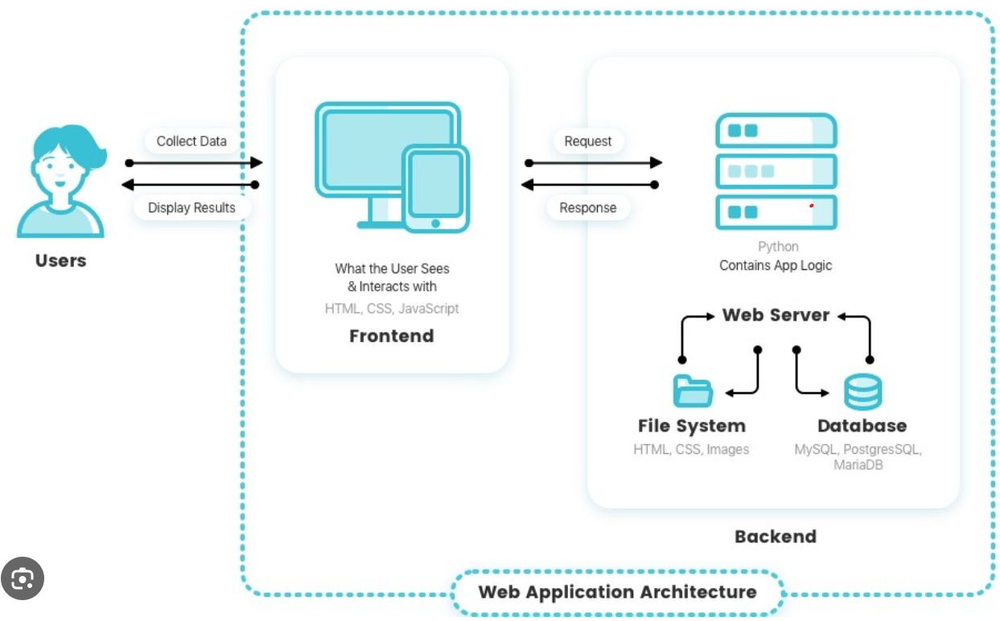

## Exploring Web Development with Python

### User Interaction with the Website (Front-End):

- Users interact with the website through the front-end, which includes elements like buttons, forms, and navigation menus.
- Python's Role: Python is not commonly used for front-end development, it can serve data to front-end technologies and handle requests through frameworks like Django and Flask.
### Request to Web Server:
- Description: When a user performs an action (like clicking a button), a request is sent to the web server.
- Python's Role: Python-based web frameworks (**Django, Flask**) can be used to create web servers that receive and process these requests.
### Server-Side Logic (Back-End):
- The server processes the request, which may involve executing business logic, handling user inputs, or interacting with a database.
- Python's Role: Key Python frameworks and libraries include:
  - **Django**: A high-level Python web framework that encourages rapid development.
  - **Flask:** A micro web framework for Python making it ideal for smaller applications and microservices.
  - **FastAPI:** A modern, fast (high-performance) web framework for building APIs.
### Database Interaction:
- The server may need to retrieve or store data in a database based on the user's request.
- Python's Role: Python can interact with databases using libraries like **SQLAlchemy** or **Django ORM**, performing operations like querying or updating data.
### Integration with External APIs:
- The server might also interact with external services or APIs for additional functionalities, such as payment processing or fetching external data.
- Python's Role: Libraries like **requests** are commonly used for making HTTP requests to APIs in a straightforward manner. For more complex interactions, libraries such as **urllib3** or **httpx** offer advanced features.
### Processing and Response:
- After processing the request, the server sends a response back to the user's browser, which may include data to be rendered on the front-end.
- Python's Role: Django framework offers a comprehensive solution with its built-in **HttpResponse** class in the **django.http** module, which is used to manage responses. 
### Data Analysis and Machine Learning (If Applicable):
- Websites often collect data that can be used for analytics or machine learning purposes.
- Python's Role: Python shines in data analysis and machine learning with libraries like **Pandas, NumPy,** and frameworks like **TensorFlow,** enabling advanced functionalities like personalized recommendations.
### Deployment and Scaling:
- Deploying a website involves hosting it on a server, making it accessible to users over the internet, and scaling resources as needed.
- Python's Role: Python applications can be containerized using Docker and managed using tools like Kubernetes for scaling and cloud deployment.
